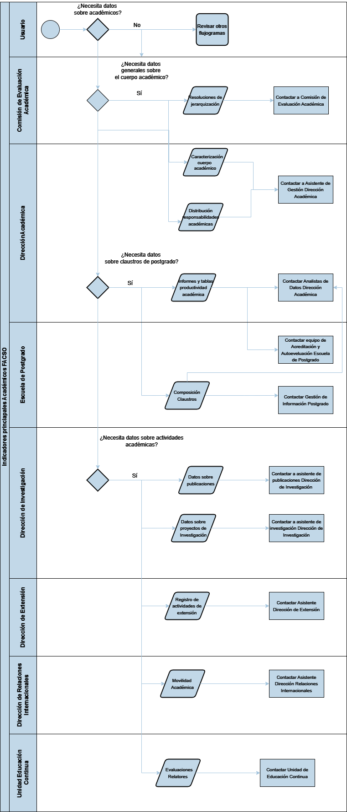

# Datos sobre Académicos

La **figura 4**, presenta las unidades y direcciones que procesan datos sobre el cuerpo académico de la Facultad. Las unidades involucradas son la Comisión de Evaluación Académica, la Dirección Académica, la Escuela de Postgrado, la Dirección de Investigación, la Dirección de Extensión, la Dirección de Relaciones Internacionales, y la Unidad de Educación Continua. 

*Figura 4: Flujograma Datos Académicos*

