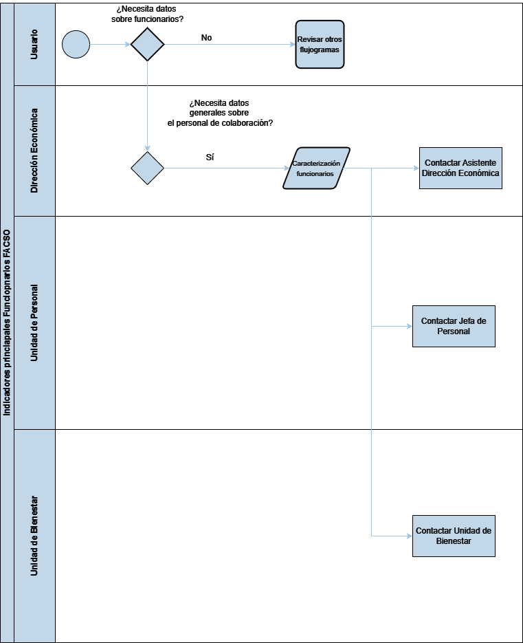

# Datos sobre Funcionarios

La **figura 5**, presenta las unidades y direcciones que procesan datos sobre el cuerpo académico de la Facultad. Las unidades involucradas son la Dirección Económica, la Unidad de Personal y la Unidad de Bienestar. 

*Figura 5: Flujograma Datos Funcionarios*